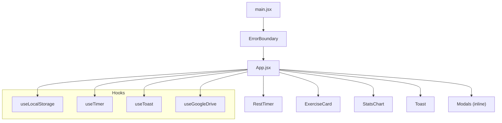
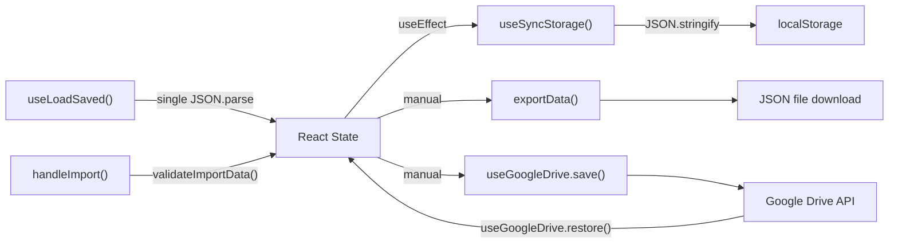
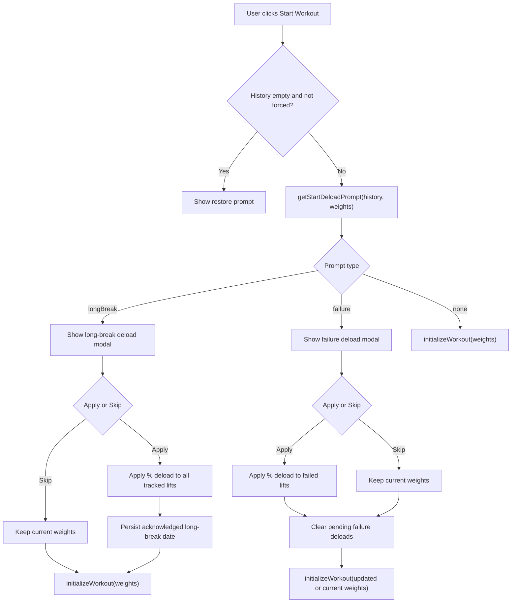

# Application Architecture

## Overview

Strength 5x5 is a client-side React application with no backend. All data is stored in the browser's localStorage. The app is built with Vite, styled with Tailwind CSS, and deployed to Vercel.

## Project Structure

```
strength5x5/
  index.html              # HTML entry point (GIS script, manifest link)
  vite.config.js          # Vite build configuration
  tailwind.config.js      # Tailwind CSS configuration
  vercel.json             # Security headers (CSP, X-Frame-Options, etc.)
  .env.example            # Environment variables template
  src/
    main.jsx              # React entry point (StrictMode + ErrorBoundary)
    App.jsx               # App shell: all state, tab routing, modals
    constants.js           # Workouts, weights, storage keys, limits
    utils.js               # Pure functions (plates, 1RM, deload, validation)
    index.css              # Tailwind base imports
    components/
      ExerciseCard.jsx     # Single exercise during a workout (React.memo)
      RestTimer.jsx        # Rest countdown + lifting stopwatch (React.memo)
      StatsChart.jsx       # Recharts-powered progress charts
      ErrorBoundary.jsx    # React error boundary (class component)
      Toast.jsx            # Toast notification display
    hooks/
      useLocalStorage.js   # Load, sync, and cross-tab storage hooks
      useTimer.js          # Wall-clock anchored timer
      useToast.js          # Toast state management
      useGoogleDrive.js    # Google Drive backup/restore (optional)
    utils/
      chartData.js         # Timeline builders, trends, workout stats
      convertStronglifts.js # StrongLifts CSV parser
    i18n/
      index.js             # i18next configuration
      locales/
        en.json            # English translations
        fr.json            # French translations
    __tests__/             # Mirrors source structure
    test/
      setup.js             # Vitest setup (i18n, localStorage mock)
      fixtures/            # Test data files
  docs/                    # Architecture and integration documentation
```

## Component Hierarchy



## State Management

All application state lives in `App.jsx` via `useState` hooks. There is no external state management library.

**Persisted state** (saved to localStorage on every change):
- `weights` -- current working weights per exercise
- `history` -- array of completed workout sessions
- `nextType` -- next workout type (A or B)
- `isDark` -- dark mode preference
- `autoSave` -- auto-backup toggle
- `preferredRest` -- rest timer duration
- `soundEnabled` -- sound alert toggle
- `vibrationEnabled` -- vibration toggle
- `logGrouping` -- history grouping mode

**Transient state** (not persisted):
- `activeTab`, `isWorkoutActive`, `currentWorkout`
- Modal visibility flags
- UI state (expanded warmups, nav, etc.)

**Active workout recovery**:
- During a workout, workout state is saved to a separate localStorage key (`ACTIVE_WORKOUT_KEY`)
- On reload, if an active workout exists and is less than 24 hours old, a resume prompt appears

## Data Flow



Key characteristics:
- localStorage is parsed **once** on mount via `useMemo` in `useLoadSaved()`
- State syncs to localStorage on every change via `useSyncStorage()`
- Cross-tab sync via `storage` event listener in `useStorageSync()`
- Schema versioning (`SCHEMA_VERSION`) with forward migration support

## Deload Start Flow

Deload prompting is decided from one start-time gate in `App.jsx` (`getStartDeloadPrompt(...)`).

Decision precedence:
1. Long-break deload due and not yet acknowledged for the latest workout date.
2. Failure deload due (3+ consecutive failures at the current weight).
3. No prompt, start workout directly.



Related behavior:
- Completion summary only displays `Deload needed`; it does not open a deload modal.
- Manual log save never opens the failure-deload modal immediately.
- Both paths defer prompting until the next `Start Workout`.

Regression coverage:
- Deferred completion prompt and start-time failure modal: `src/__tests__/integration/workout-flow.test.jsx`
- Failure modal apply/skip both initialize workout: `src/__tests__/integration/workout-flow.test.jsx`
- Manual log creating failure streak defers prompt to next start: `src/__tests__/integration/settings.test.jsx`
- Long-break prompt behavior and acceptance/skip paths: `src/__tests__/integration/settings.test.jsx`

## Internationalization

- **Library**: react-i18next with i18next-browser-languagedetector
- **Languages**: English (default), French
- **Detection order**: localStorage (`strength5x5_lang`) then browser navigator
- **Convention**: All user-facing strings use `t()` from `useTranslation()`. Utility functions that produce user-facing text accept a `t` parameter.
- **Exercise names**: Kept in English in both locales (standard gym terminology)

## Styling

- Tailwind CSS utility classes only -- no CSS modules or styled-components
- Dark/light mode via conditional class strings keyed on `isDark` prop
- Mobile-first design with `max-w-md mx-auto` container
- Rounded cards with `rounded-[2rem]` / `rounded-[2.5rem]`

## Testing

- **Runner**: Vitest with jsdom environment
- **Libraries**: React Testing Library, @testing-library/user-event
- **Setup**: `src/test/setup.js` imports i18n and mocks localStorage + matchMedia
- **Categories**:
  - Unit tests: pure functions in `utils.js`, `chartData.js`, `convertStronglifts.js`
  - Component tests: `RestTimer`, `ExerciseCard`
  - Hook tests: `useTimer`, `useToast`, `useGoogleDrive`
  - Integration tests: workout flow, import/export, settings, UI behavior

## Security

- **CSP**: Strict Content Security Policy via `vercel.json`
- **Import validation**: File size limit (`MAX_IMPORT_SIZE`), schema validation (`validateImportData`), key whitelisting (`EXPECTED_WEIGHT_KEYS`)
- **Token handling**: Google OAuth tokens are kept in memory only, never persisted
- **Error boundary**: Wraps entire app, prevents white-screen crashes
