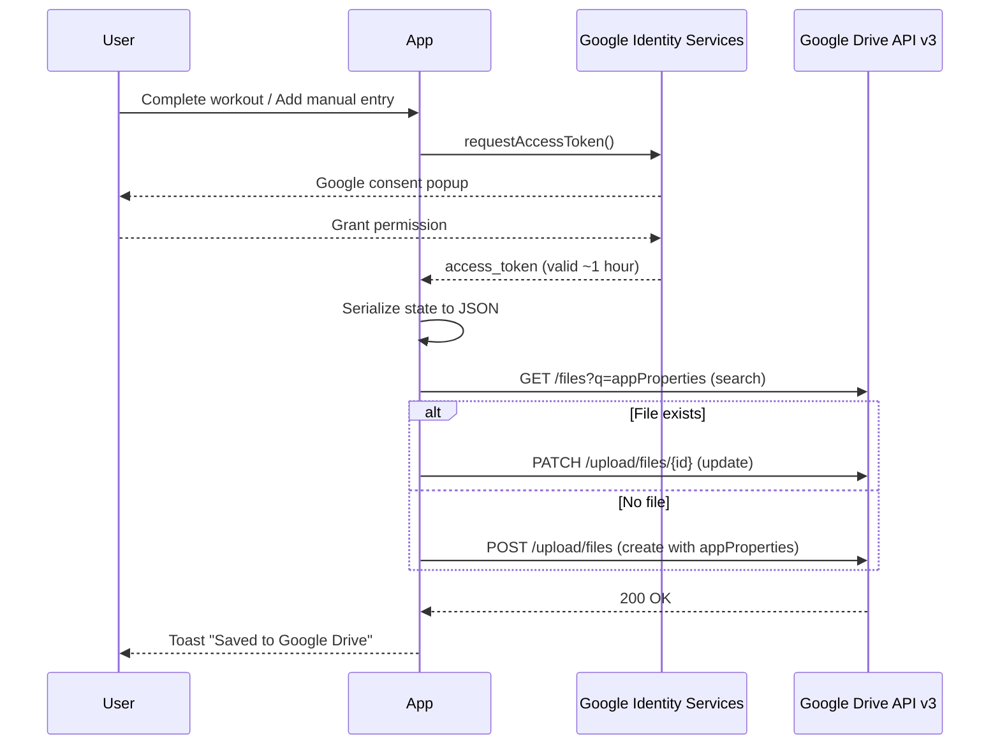
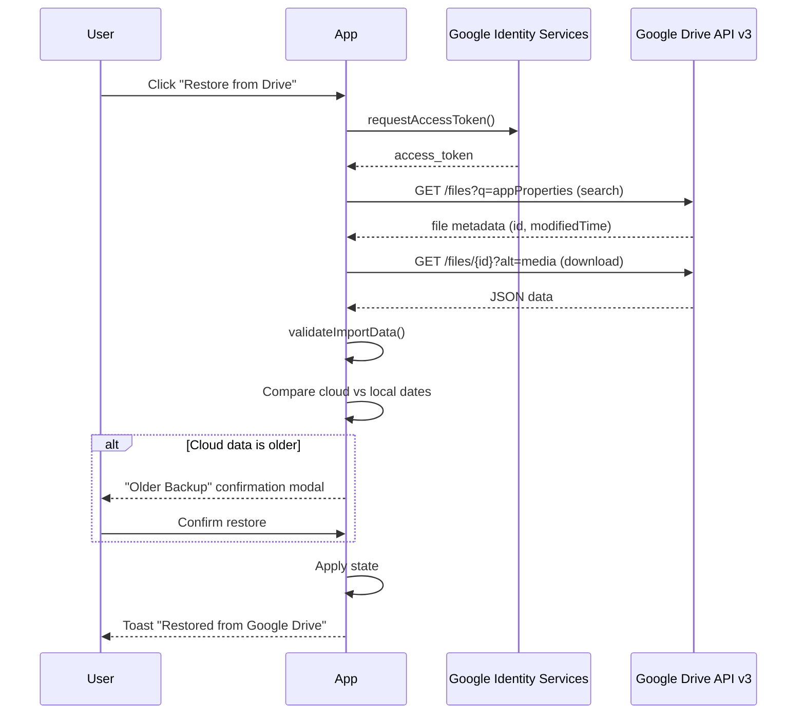

# Google Drive Sync

Optional cloud backup integration that saves/restores the app's JSON state to the user's Google Drive. The app remains fully local-first -- Drive is used as an automatic cloud backup, syncing after every completed or manually-entered workout.

## Architecture





## Authentication

- **Library**: Google Identity Services (GIS) loaded via `<script>` tag in `index.html`
- **Flow**: OAuth 2.0 implicit grant via `google.accounts.oauth2.initTokenClient`
- **Scope**: `https://www.googleapis.com/auth/drive.file` (only files created by the app)
- **Token storage**: In-memory only (`useRef`), never persisted to localStorage
- **Token lifetime**: ~1 hour. A timer clears the token 60 seconds before expiry. If expired, the next save/restore click re-prompts the user.
- **No backend required**: The implicit flow returns access tokens directly to the browser. No authorization code exchange or refresh tokens.

## File Identification

Files are identified by `appProperties` metadata rather than filename, which prevents breakage if the user renames the file in Google Drive.

- **On create**: `appProperties: { app: 'strength5x5' }` is set in the file metadata
- **On search**: Query uses `appProperties has { key='app' and value='strength5x5' }`
- **Filename**: `strength5x5_backup_v1.json` (the `v1` suffix allows format changes in future versions)
- **Single file**: The backup is always overwritten on save. No date-appended copies are created.

## Upload/Download Mechanics

All Drive API calls use plain `fetch()` -- no `gapi` client library.

**Save (upload)**:
1. Serialize state to JSON
2. Check payload size against `MAX_IMPORT_SIZE` (5 MB). Reject if exceeded.
3. Search Drive for existing backup via `appProperties` query
4. If found: `PATCH` multipart upload to update the file
5. If not found: `POST` multipart upload to create a new file with `appProperties`

**Restore (download)**:
1. Search Drive for backup file
2. Download via `GET /files/{id}?alt=media`
3. Validate through `validateImportData()` (same validation as local JSON import)
4. Compare most recent history dates between cloud and local data
5. If cloud data is older, show confirmation modal before applying

## Restore Safety

Before applying restored data, the hook compares the most recent `history[].date` in the cloud data against the local data. If the cloud backup is older, a confirmation modal warns the user:

> "Cloud backup is from March 3. Local data is from March 15. Restore anyway?"

This prevents accidental data loss when restoring an outdated backup.

## CSP Changes

The Content Security Policy in `vercel.json` is relaxed to allow Google origins:

| Directive | Added origins |
|-----------|--------------|
| `script-src` | `https://accounts.google.com` (GIS script) |
| `connect-src` | `https://www.googleapis.com` (Drive API), `https://accounts.google.com` |

## Conditional Rendering

The Google Drive section in Options only renders when `VITE_GOOGLE_CLIENT_ID` is set. If the environment variable is missing, the feature is completely hidden -- no UI, no script initialization.

## Google Cloud Console Setup

1. Go to [Google Cloud Console](https://console.cloud.google.com/)
2. Create a new project (or select an existing one)
3. Navigate to **APIs & Services > Library** and enable **Google Drive API**
4. Navigate to **APIs & Services > OAuth consent screen**
   - User type: External
   - Fill in app name, support email
   - Add scope: `https://www.googleapis.com/auth/drive.file`
5. Navigate to **APIs & Services > Credentials**
   - Create **OAuth 2.0 Client ID**
   - Application type: **Web application**
   - Authorized JavaScript origins:
     - `http://localhost:5173` (development)
     - `https://your-app.vercel.app` (production)
6. Copy the Client ID and add to `.env`:
   ```
   VITE_GOOGLE_CLIENT_ID=your-client-id.apps.googleusercontent.com
   ```
