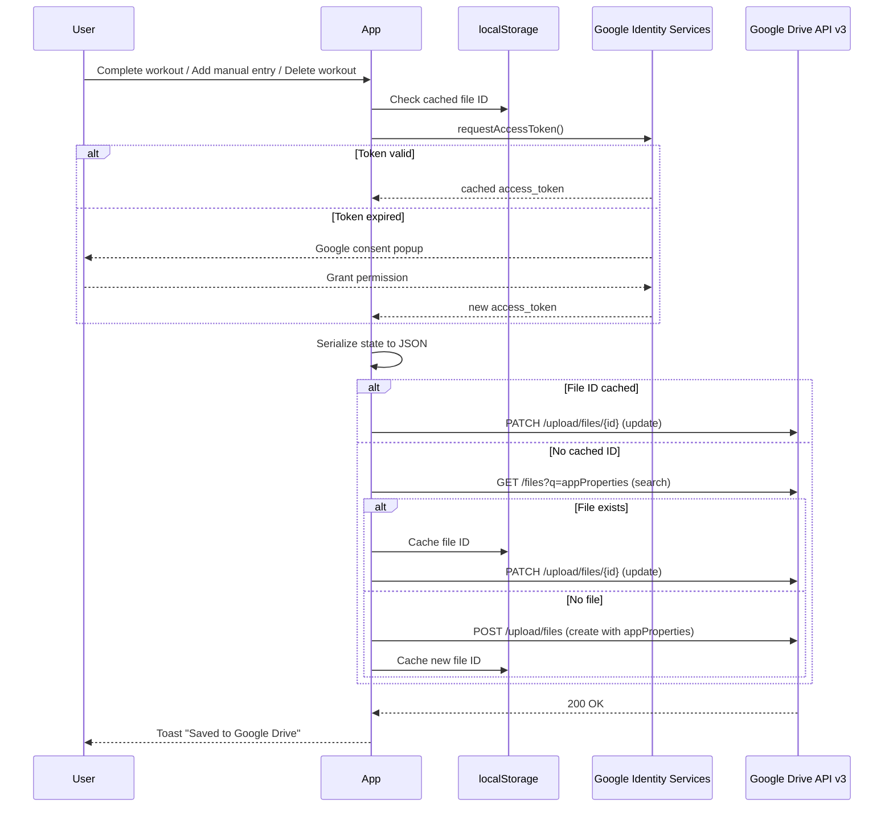
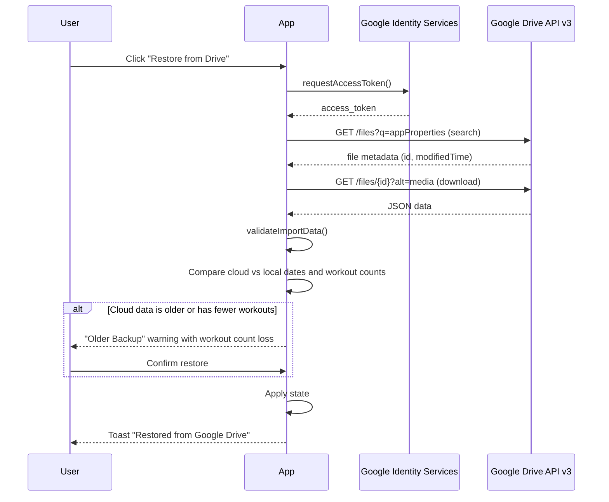

# Google Drive Sync

Optional cloud backup integration that saves/restores the app's JSON state to the user's Google Drive. The app remains fully local-first -- Drive is used as an automatic cloud backup, syncing after every completed or manually-entered workout, workout deletion, and on-demand via the Sync Now button.

## Important: File Visibility

The `drive.file` scope means the backup file is **managed entirely by the app** and is **not visible** in the Google Drive web UI. Users cannot browse to, search for, or manually download the file from drive.google.com. This is a Google security feature -- the app can only access files it created, and those files are sandboxed from the user's regular Drive file listing.

**To get a visible copy of your data**, use the "Backup to Device" button in Options. This downloads a JSON file directly to your device that you can keep, share, or re-import later.

| Method | Visible to user? | Purpose |
|--------|-----------------|---------|
| Google Drive sync | No -- app-managed, invisible | Automatic cloud backup for cross-device recovery |
| Backup to Device | Yes -- downloads a JSON file | Manual backup you can see, keep, and share |

Both protect your data. Use Drive sync for automatic safety. Use "Backup to Device" when you want a file you can access directly.

## Architecture

## Authentication

- **Library**: Google Identity Services (GIS) loaded via `<script>` tag in `index.html`
- **Flow**: OAuth 2.0 implicit grant via `google.accounts.oauth2.initTokenClient`
- **Scope**: `https://www.googleapis.com/auth/drive.file` (only files created by the app)
- **Token storage**: In-memory only (`useRef`), never persisted to localStorage
- **Token lifetime**: ~1 hour. A timer clears the token 60 seconds before expiry.
- **Re-authentication**: When the token expires, the next save/sync/restore action triggers a one-tap Google popup. The user re-authenticates and the action completes automatically.
- **Persistent config flag**: `localStorage` stores `strength5x5_gdrive_configured` (a boolean flag, not a token) so the app remembers Drive was configured across page refreshes. This allows the UI to show "Reconnect" instead of "Connect" and ensures `saveToDriveQuietly` attempts re-auth when needed.
- **No backend required**: The implicit flow returns access tokens directly to the browser. No authorization code exchange or refresh tokens.

## File Identification

Files are identified by `appProperties` metadata rather than filename, which prevents breakage if the user renames the file in Google Drive.

- **On create**: `appProperties: { app: 'strength5x5' }` is set in the file metadata
- **On search**: Query uses `appProperties has { key='app' and value='strength5x5' }`
- **Filename**: `strength5x5_backup_v1.json` (the `v1` suffix allows format changes in future versions)
- **Single file**: The backup is always overwritten on save. No date-appended copies are created.

## File ID Caching

After the first save, the Drive file ID is cached in `localStorage` (`strength5x5_drive_file_id`). This skips the search API call on subsequent saves, reducing Drive API traffic from 2 calls to 1.

- **First save**: search + upload (2 API calls)
- **Subsequent saves**: upload only (1 API call)
- **404 handling**: If the cached file was deleted from Drive, the upload returns 404. The cache is cleared and the save retries once (search for existing file or create a new one).

## Upload/Download Mechanics

All Drive API calls use plain `fetch()` -- no `gapi` client library.

**Save (upload)**:
1. Serialize state to JSON
2. Check payload size against `MAX_IMPORT_SIZE` (5 MB). Reject if exceeded.
3. If file ID is cached in localStorage, skip to step 5
4. Search Drive for existing backup via `appProperties` query. Cache the ID if found.
5. If found: `PATCH` multipart upload to update the file
6. If not found: `POST` multipart upload to create a new file with `appProperties`
7. Cache the returned file ID in localStorage

**Restore (download)**:
1. Search Drive for backup file
2. Download via `GET /files/{id}?alt=media`
3. Validate through `validateImportData()` (same validation as local JSON import)
4. Compare most recent history dates and workout counts between cloud and local data
5. If cloud data is older or has fewer workouts, show confirmation modal with workout loss count before applying

## When Drive Syncs

| Action | Syncs to Drive? |
|--------|----------------|
| Finish workout | Yes (automatic) |
| Add manual workout entry | Yes (automatic) |
| Edit existing workout | Yes (automatic) |
| Delete workout | Yes (automatic) |
| Local JSON import | Yes (automatic) |
| StrongLifts CSV import | Yes (automatic) |
| Click "Sync Now" button | Yes (manual) |
| Adjust weights (+/- buttons) | No -- synced on next workout |
| Accept deload | No -- synced on next workout |
| Change settings (dark mode, rest timer, etc.) | No -- use "Sync Now" to push immediately |

## Conflict Resolution

When connecting to Drive with data on both sides, a "Data Conflict" modal shows workout counts and dates for both, and offers two choices:

- **Use Drive Data** -- restores from Drive, replacing local data
- **Use Local Data** -- pushes local data to Drive, overwriting the backup

When restoring from Drive or importing a local file with fewer workouts than current data, a warning shows: "This backup has X workouts. You have Y workouts. You'll lose Z workouts."

## UI States

The Google Drive section in Options shows three states:

| State | Icon color | Button | Status text |
|-------|-----------|--------|-------------|
| Never connected | Grey | "Connect" | -- |
| Connected (token valid) | Green | "Connected" badge | Last saved time, Sync Now button |
| Configured but token expired | Amber | "Reconnect" | Last saved time, Sync Now button |

## Data Recovery

If localStorage is wiped (browser data cleared, new device), the app detects an empty state when the user clicks "Start Workout". The restore prompt includes a "Restore from Google Drive" button that connects to Drive, finds the backup, and restores all data in one tap.

## CSP Changes

The Content Security Policy in `vercel.json` is relaxed to allow Google origins:

| Directive | Added origins |
|-----------|--------------|
| `script-src` | `https://accounts.google.com` (GIS script) |
| `connect-src` | `https://www.googleapis.com` (Drive API), `https://accounts.google.com` |

## Conditional Rendering

The Google Drive section in Options only renders when `VITE_GOOGLE_CLIENT_ID` is set. If the environment variable is missing, the feature is completely hidden -- no UI, no script initialization.

## Setup

For step-by-step instructions on creating the Google Cloud project, configuring OAuth, and setting the environment variable for local development and production, see [Deployment](deployment.md#2-google-drive-setup-optional).
